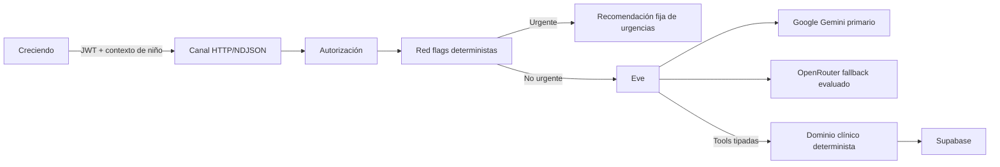

# Agent Trujillo

Backend pediátrico y agente autónomo de Creciendo construido sobre Eve. Este repositorio es dueño de los contratos HTTP/streaming, autorización, motores clínicos deterministas, tools, workflows, integraciones, migraciones de Supabase y auditoría.

Agent Trujillo ofrece orientación básica para tutores. Nunca diagnostica ni prescribe. Recomienda mantener contacto con un pediatra y, cuando una regla determinista detecta gravedad, responde únicamente que se debe acudir inmediatamente a urgencias. No crea alarmas, casos, contactos automáticos ni agenda consultas.

## Estado

El repositorio parte de Eve 0.27.1, AI SDK 7 y Node.js 24. Supabase CLI 2.114.0 está configurada y el proyecto remoto `CreciendoApp` fue reconstruido el 14 de agosto de 2026 desde tres migraciones limpias.

Los 17 SQL rescatados de `doc-trujillo` viven en `supabase/legacy-reference/` y nunca forman parte de la ruta ejecutable. El remoto actual contiene 56 tablas con RLS forzado, cinco buckets privados y módulos normalizados para acceso, antropometría, vacunación CO/US, medicación, desarrollo, chat/memoria, documentos y comercio.

Antes de escribir código Eve se deben leer las guías exactas instaladas en `node_modules/eve/docs/`, como exige `AGENTS.md`.

## Responsabilidades

- Verificar identidad, espacio de cuidado, permisos y niño activo.
- Exponer comandos y consultas versionados para Creciendo.
- Ejecutar la evaluación determinista de red flags antes del LLM.
- Orquestar chat, streaming, tools y memoria mediante Eve.
- Calcular crecimiento, vacunación y límites farmacológicos con motores versionados.
- Persistir datos en Supabase con RLS, grants y auditoría.
- Aislar embeddings y recuperaciones por espacio de cuidado y niño.
- Procesar webhooks y entitlements de Apple, Google y Stripe de forma idempotente.
- Ejecutar trabajos asíncronos que no pertenezcan al camino urgente.

No son responsabilidades de este repositorio:

- Diagnosticar, prescribir o sustituir una consulta pediátrica.
- Permitir que el modelo seleccione libremente un niño o una jurisdicción.
- Generar código de interfaz que el móvil ejecute.
- Mantener un portal profesional, bandeja clínica o contacto automático con el Dr. Trujillo.
- Considerar Vercel Flags o un proveedor de pago como autoridad única de acceso.

## Documentación

- [Mapa de contextos](./CONTEXT-MAP.md)
- [Arquitectura del backend](./docs/architecture/system.md)
- [Modelo de datos objetivo](./docs/architecture/data-model.md)
- [Integraciones Vercel, IA y pagos](./docs/architecture/platform-integrations.md)
- [Contrato de seguridad clínica](./docs/clinical/safety-contract.md)
- [Catálogo de tools](./docs/clinical/tool-catalog.md)
- [Registro de fuentes clínicas](./docs/clinical/source-registry.md)
- [Integración con Creciendo](./docs/integration/mobile-contract.md)
- [Auditoría y migración de Supabase](./docs/operations/supabase.md)
- [Auditoría de legados y deprecación](./docs/legacy/audit-and-deprecation.md)
- [Programa de implementación](./docs/roadmap.md)
- [Plan de la fundación backend](./docs/superpowers/plans/2026-08-14-backend-foundation.md)
- [Verificación documental y baseline](./docs/verification/2026-08-14-documentation.md)
- [Decisiones arquitectónicas](./docs/adr/)

## Arquitectura resumida



Eve orquesta la conversación; no contiene la verdad clínica. Tanto los endpoints ordinarios como las tools llaman las mismas interfaces de dominio.

## Comandos actuales

```bash
npm install
npm run dev
npm run typecheck
npm run build
npx supabase --version
npx supabase migration list --linked
npx supabase db lint --linked --schema public,storage --level warning
```

Todo cambio posterior sigue el flujo de prueba, migración forward-only, revisión y verificación descrito en [docs/operations/supabase.md](./docs/operations/supabase.md).
