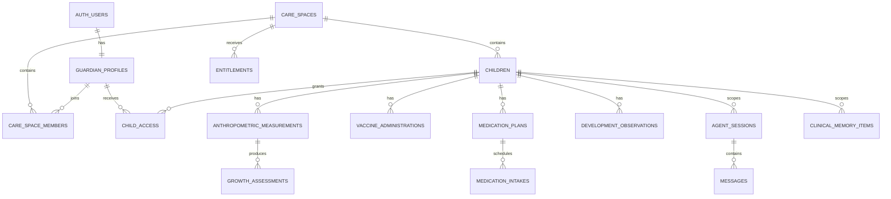

# Modelo de datos objetivo

Este documento define el modelo conceptual que debe contrastarse con el Supabase remoto antes de escribir una migración. No autoriza aplicar los SQL legados.

## Principios

1. El espacio de cuidado es la raíz multi-tenant.
2. Un tutor puede pertenecer a varios espacios y cuidar varios niños.
3. Un niño pertenece a un espacio de cuidado; el acceso al niño define qué tutor puede actuar sobre él sin representar custodia legal.
4. Toda fila clínica contiene `care_space_id` y `child_id` cuando aplica.
5. Fechas clínicas conservan instante UTC, zona IANA y fecha local cuando la semántica lo exige.
6. Cantidades conservan valor y unidad; nunca dependen de una unidad implícita.
7. Hechos declarados y evaluaciones calculadas viven separados.
8. Toda evaluación conserva paquete clínico, algoritmo y versión de datos.
9. La procedencia distingue tutor, profesional, importación, documento y extracción de chat.
10. Las eliminaciones sensibles usan retención definida y auditoría; no cascadas accidentales.

## Relación principal

## Acceso y consentimiento

| Tabla conceptual | Datos esenciales | Invariantes |
|---|---|---|
| `guardian_profiles` | `user_id`, nombre, locale | `user_id` referencia `auth.users`; rol administrativo no proviene de metadata del cliente |
| `care_spaces` | nombre, país predeterminado, estado | raíz de aislamiento y facturación |
| `care_space_members` | espacio, tutor, rol | única relación por par; roles permitidos y sin autoelevación |
| `children` | espacio, nacimiento, país de cuidado, zona, sexo de referencia, gestación | no contiene `parent_id` único; país y zona son explícitos |
| `child_access` | niño, tutor, permisos, vigencia | acceso mínimo por niño; puede revocarse sin borrar al tutor |
| `consent_definitions` | tipo, versión, jurisdicción, texto/hash | definiciones inmutables una vez publicadas |
| `consent_records` | tutor, niño/espacio, definición, decisión, fecha | conserva historial y revocación |

Permisos iniciales de `child_access`: `read`, `record`, `manage_documents`, `manage_medication`, `manage_guardians`. Las tools verifican el permiso específico, no un rol genérico.

## Paquetes clínicos

| Tabla conceptual | Propósito |
|---|---|
| `clinical_sources` | autoridad, jurisdicción, título, URL/cita, fecha, vigencia y licencia |
| `clinical_rule_packs` | dominio, país, versión semántica, estado y periodo efectivo |
| `clinical_rule_pack_sources` | trazabilidad entre paquete y fuentes |
| `clinical_approvals` | aprobador, artefacto, hash, fecha y decisión |
| `clinical_algorithms` | identificador y versión del algoritmo reproducible |

Ciclo: `draft → reviewed → approved → active → retired`. Solo un paquete activo puede aplicar a un dominio, país y fecha determinados. Activar exige aprobación del Dr. Trujillo y artefacto con hash coincidente.

## Antropometría

`anthropometric_measurements` conserva:

- tipo: `weight`, `recumbent_length`, `standing_height`, `head_circumference`;
- valor y unidad original;
- valor normalizado;
- instante, fecha local y zona horaria;
- método, dispositivo opcional y procedencia;
- estado de validación y motivo de exclusión;
- idempotency key y actor.

`growth_assessments` referencia una medición y conserva edad cronológica, edad corregida aplicada, estándar, indicador, Z-score, percentil derivado, versión de algoritmo y paquete. Los valores “actuales” son proyecciones, no columnas duplicadas en `children`.

## Vacunación

Tablas de referencia:

- `vaccine_products` y `vaccine_antigens`;
- `immunization_schedules` por país y versión;
- `immunization_rules` para edades, intervalos, series y catch-up;
- `immunization_rule_dependencies` para relaciones entre dosis.

Datos del niño:

- `vaccine_administrations` con fecha, producto, lote opcional, lugar, procedencia y estado de confirmación;
- `vaccine_documents` como vínculo a evidencia privada;
- `vaccination_assessments` como proyección reproducible, nunca fuente de verdad.

PAI y ACIP no comparten reglas activas. Un niño se evalúa con su `country_of_care` y la fecha efectiva; cambiar país no borra administraciones.

## Medicación

Referencia aprobada:

- `medication_concepts` con identificadores normalizados y nombres locales;
- `medication_presentations` con concentración y unidad;
- `pediatric_formulary_versions`;
- `pediatric_dose_limits` con indicación/condición, edad, peso, vía, dosis por toma, dosis diaria, máximos y exclusiones.

Seguimiento:

- `medication_plans` con procedencia, prescriptor declarado opcional, inicio/fin y estado;
- `medication_schedules` con cantidad, unidad, vía, frecuencia y zona;
- `medication_intakes` con momento previsto/real y estado;
- `dose_validations` con inputs, resultado, peso usado y versión de formulario.

Una validación contrasta una dosis ya declarada. No crea un plan ni propone un medicamento.

## Desarrollo

- `development_frameworks`: fuente, país, versión y tipo de instrumento;
- `development_milestones`: dominio, ventana de edad y copy aprobado;
- `development_observations`: declaración, fecha, procedencia y adjuntos;
- `screening_sessions`: reservado a instrumentos y roles autorizados.

Las observaciones del tutor no generan un resultado EAD-3. Cualquier tamizaje profesional futuro requiere alcance y diseño separado.

## Conversación y memoria

- `agent_sessions`: niño inmutable, canal, estado, modelo/configuración inicial y fechas;
- `messages`: actor, parts estructuradas, secuencia, estado y uso;
- `tool_executions`: tool/version, inputs redactados, autorización, confirmación, resultado y latencia;
- `clinical_memory_items`: tipo, contenido estructurado, procedencia, estado de confirmación y vigencia;
- `clinical_memory_embeddings`: `care_space_id`, `child_id`, `memory_item_id`, modelo y vector;
- `conversation_summaries`: alcance por sesión y niño, versión de generador y fuentes.

Embeddings nunca se consultan sin filtros de espacio y niño antes de ordenar por similitud. La RPC vuelve a comprobar membresía y no tiene `EXECUTE` público.

## Documentos y Storage

Buckets privados separados por propósito: `vaccine-documents`, `clinical-attachments`, `generated-reports` y `avatars`. La ruta física incluye espacio y niño, pero la autorización no confía solo en el path.

Una tabla `documents` conserva propietario, niño, bucket, object key, MIME detectado, tamaño, checksum, estado antivirus/extracción, retención y procedencia. El móvil recibe URLs firmadas de corta duración; el modelo recibe una URL aún más breve o bytes controlados.

## Comercio

- `billing_customers`: asociación por espacio y proveedor;
- `billing_products`: mapeo del plan interno a productos Apple/Google/Stripe;
- `billing_events`: ledger append-only con provider event ID único;
- `purchases`: periodos y estados verificados;
- `entitlements`: capacidad, inicio, fin, origen y estado calculado;
- `usage_ledger`: consumo idempotente por capacidad.

Los webhooks actualizan el ledger; una proyección calcula entitlements. Nunca se confía solo en `subscription_status` dentro de un perfil.

Las Supabase Edge Functions verifican y anexan eventos del proveedor. La reconciliación durable se ejecuta después; la recepción HTTP no modifica directamente un entitlement.

## Auditoría

`audit_events` es append-only e incluye actor, espacio, niño cuando aplica, acción, recurso, request ID, resultado, política y timestamp. No guarda prompts completos, contenido clínico innecesario ni secretos. El acceso a auditoría es privilegiado y no existe portal profesional en V1.

## RLS y grants

- Activar RLS en toda tabla expuesta.
- `anon` no accede a datos clínicos.
- `authenticated` solo usa vistas/RPC expresamente permitidas; las mutaciones ordinarias pasan por backend.
- Las políticas comprueban membresía vigente y acceso explícito al niño.
- Operaciones administrativas usan roles separados y no metadata editable por el usuario.
- Funciones fijan `search_path`, usan nombres totalmente calificados y revocan permisos por defecto.
- Pruebas negativas cubren hermanos, espacios distintos, accesos revocados y tokens expirados.

## Estado de implementación

El Supabase remoto fue inventariado y reconstruido el 14 de agosto de 2026. El modelo se implementa en tres migraciones limpias dentro de `supabase/migrations/`; los SQL anteriores se conservan únicamente en `supabase/legacy-reference/`.

La evidencia posterior confirma 56 tablas, RLS habilitado y forzado en todas ellas, cinco buckets privados, cero grants de tablas para `anon`, tres versiones de migración y ausencia de tablas legadas. Véase `docs/audits/supabase/2026-08-14/inventory.md`.
