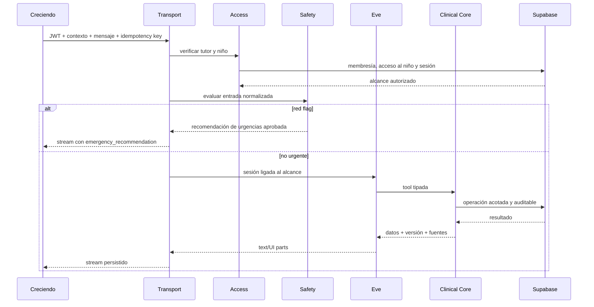

# Arquitectura de Agent Trujillo

## Decisión principal

Agent Trujillo es un backend modular desplegable como una unidad. Eve es el runtime del agente y consume el dominio pediátrico a través de interfaces tipadas. La lógica clínica no vive en prompts, rutas HTTP, componentes móviles ni SQL ad hoc.

Se mantienen dos repositorios activos:

- `agent-trujillo`: backend, agente, dominio, Supabase e integraciones;
- `creciendo`: cliente móvil Expo.

`doc-trujillo` y `creciendo_mobile` son fuentes temporales de auditoría y después se archivan.

## Módulos y seams

```text
agent-trujillo/
├── agent/                         # definición filesystem-first de Eve
│   ├── instructions.md
│   ├── tools/
│   ├── skills/
│   ├── channels/
│   └── evals/
├── src/
│   ├── transport/                 # interfaces HTTP/NDJSON, parsing y envelopes
│   ├── access/                    # identidad, permisos y alcance autorizado
│   ├── safety/                    # red flags y modos de respuesta
│   ├── clinical/
│   │   ├── anthropometry/
│   │   ├── immunization/
│   │   ├── medication/
│   │   ├── development/
│   │   ├── nutrition/
│   │   └── memory/
│   ├── conversation/              # adaptación entre Eve y el dominio
│   ├── commerce/                  # ledger y entitlements
│   ├── workflows/                 # tareas durables no urgentes
│   ├── persistence/               # adapters Supabase/Postgres/Storage
│   ├── observability/             # auditoría, métricas y trazas seguras
│   └── config/                    # configuración validada al iniciar
├── supabase/
│   ├── config.toml
│   ├── migrations/
│   ├── functions/                 # ingress firmado; sin reglas clínicas
│   ├── seed.sql
│   └── tests/
└── evals/                         # regresión clínica y de modelos
```

Las rutas y tools son adapters delgados. No contienen reglas: construyen un `AuthorizedChildScope`, llaman una interface de módulo y serializan el resultado.

## Canales Eve

- `agent/channels/eve.ts` conserva las rutas estándar `/eve/v1/*` para CLI, desarrollo y operación interna, protegidas por Vercel OIDC/local. No es la entrada pública de la app.
- `agent/channels/creciendo.ts` será un canal personalizado para el móvil. Verifica Supabase JWT, autoriza la conversación y el niño en cada ruta, y liga su estado durable al `AuthorizedChildScope` inicial.
- El canal móvil entrega un stream NDJSON reanudable basado en eventos de Eve, pero nunca permite inspeccionar una sesión solo por conocer su `sessionId`.
- Las consultas y comandos no conversacionales comparten la misma autenticación y llaman directamente los módulos de dominio.

Esta separación es necesaria porque la documentación de Eve especifica que route auth protege las rutas, pero no implementa ownership multiusuario de una sesión. La propiedad autorizada de cada conversación es responsabilidad de Agent Trujillo.

## Interfaces principales

```ts
type AuthorizedChildScope = Readonly<{
  actorUserId: string;
  careSpaceId: string;
  childId: string;
  permissions: readonly string[];
  countryOfCare: "CO" | "US";
  timezone: string;
  expiresAt: string;
}>;

type ClinicalResult<T> = Readonly<{
  data: T;
  rulePack: { id: string; version: string; effectiveAt: string };
  sources: readonly { authority: string; reference: string }[];
  warnings: readonly string[];
}>;
```

`AuthorizedChildScope` solo puede producirlo el módulo `access`. Los módulos clínicos no aceptan `tenantId` o `childId` sueltos. Esto convierte el aislamiento en parte de la interface y reduce llamadas incompletas.

Interfaces externas iniciales:

- `authorizeChild(actor, requestedChild): AuthorizedChildScope`
- `evaluateRedFlags(scope, normalizedMessage): SafetyDecision`
- `recordAnthropometry(scope, command): ClinicalResult<Measurement>`
- `evaluateGrowth(scope, query): ClinicalResult<GrowthSeries>`
- `evaluateVaccination(scope, query): ClinicalResult<VaccinationStatus>`
- `validateDeclaredDose(scope, command): ClinicalResult<DoseValidation>`
- `recordDevelopmentObservation(scope, command): Observation`
- `searchClinicalMemory(scope, query): MemoryResult[]`
- `resolveEntitlements(careSpace, now): EntitlementSet`

Las dependencias externas usan ports únicamente cuando existen dos adapters justificados: producción y fake de pruebas. Google/OpenRouter, Supabase, Apple, Google Play y Stripe nunca se crean dentro de los módulos que los consumen.

## Flujo de chat



La evaluación de red flags no depende de que el modelo termine una respuesta. El modelo puede ayudar a normalizar lenguaje únicamente después de una primera capa determinista y nunca puede rebajar una decisión urgente.

## Eve

- Una sesión durable queda ligada a un único `AuthorizedChildScope` y no puede cambiar de niño.
- Las instrucciones describen uso previsto, abstención, tool policy y copy; no implementan fórmulas.
- Las tools de Eve adaptan schemas Zod a interfaces del dominio.
- Escrituras sensibles requieren confirmación explícita del tutor con el payload final.
- La memoria de Eve y la memoria vectorial se separan conceptualmente; toda recuperación clínica vuelve a verificar el alcance.
- Sandboxes y subagentes no reciben acceso clínico por defecto.
- Agent Runs y trazas deben redactar texto clínico, tokens y outputs sensibles.

## Model routing

Google Gemini es el proveedor primario. OpenRouter aporta fallback solo para modelos que hayan superado el mismo conjunto de evals. El routing se implementa detrás de un port para que el contrato del agente no dependa de un proveedor.

Condiciones:

- timeout y presupuesto por turno;
- lista explícita de modelos aprobados;
- versiones fijadas y cambio mediante rollout;
- sin fallback para cálculos deterministas;
- métricas por modelo sin prompts clínicos completos;
- circuit breaker que termina en abstención si ningún proveedor aprobado está disponible.

Vercel AI Gateway puede centralizar routing, uso y credenciales. OpenRouter continúa siendo un adapter de contingencia, no una ruta que omita evaluaciones.

## Workflows y Flags

Vercel Workflows se reserva para efectos reintentables e idempotentes:

- embeddings y reindexación;
- resúmenes largos;
- generación de documentos;
- recalcular proyecciones después de cambiar un paquete clínico;
- procesar webhooks y reconciliar entitlements;
- limpieza y retención programada.

Nunca se usa para decidir una recomendación de urgencias síncrona.

Vercel Flags controla rollout, experimentos y disponibilidad gradual. La autorización, el niño activo y los entitlements se verifican en el backend aunque una flag permita mostrar una función.

## Persistencia

- Peticiones de tutores conservan el JWT para que RLS siga aplicando cuando sea posible.
- Jobs privilegiados usan un rol separado y adapters que exigen alcance explícito.
- Ningún adapter de dominio ofrece un método “query table” genérico.
- `SECURITY DEFINER` se evita; cuando sea imprescindible fija `search_path`, verifica membresía y revoca `EXECUTE` a `PUBLIC`.
- Todos los comandos con efectos son idempotentes y escriben auditoría en la misma transacción lógica.

| Servicio Supabase | Responsabilidad |
|---|---|
| Database/PostgreSQL | fuente de verdad, constraints, proyecciones y auditoría |
| Auth | identidad de tutores y ciclo de sesión |
| RLS/grants | defensa en profundidad por espacio y niño |
| pgvector | embeddings de memoria filtrados antes de similitud |
| Storage | carnets, adjuntos y PDFs en buckets privados |
| Realtime | invalidaciones/eventos privados, no autorización |
| Edge Functions | ingreso firmado e idempotente de webhooks/callbacks |

## Fallos

- Fallo de autenticación: 401, sin acceso a Eve.
- Niño no autorizado: 403 genérico, sin revelar existencia.
- Regla clínica ausente o inconsistente: abstención y métrica operativa.
- Supabase no disponible: no confirmar escrituras; devolver error recuperable.
- Stream interrumpido: reanudar por secuencia sin repetir tools.
- Modelo no disponible: fallback evaluado o abstención.
- Webhook duplicado: devolver éxito con el resultado ya aplicado.

## Verificación

- Pruebas de cada módulo a través de su interface.
- Fakes para proveedores remotos y Postgres local controlado para RLS.
- Matriz negativa tutor × espacio × niño × tabla × operación.
- Evals de aislamiento semántico con hermanos y tutores distintos.
- Evals de red flags, abstención, prompt injection, tool misuse y fallback por modelo.
- Pruebas de contrato entre el stream NDJSON y fixtures de Creciendo.
- Revisión de logs para confirmar ausencia de PHI/PII y secretos.
